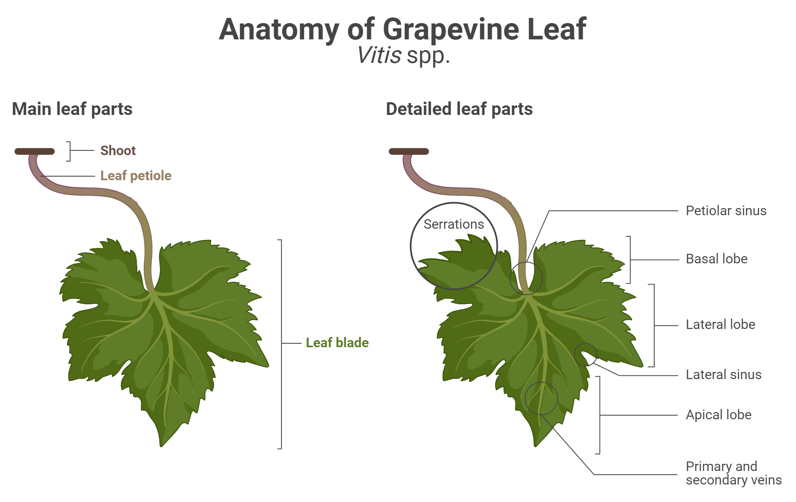

# Grape Leaf Anatomy

This page defines the grape leaf structures and normal variation terms used by
GopherEye during visual intake.



```text
image_id: grape_leaf_anatomy_001
path: wiki/reference/assets/grape leaf anatomy_2.png
caption: Simplified grape leaf anatomy diagram labeling blade, lobes, serrated
  margin, petiole, midrib, primary veins, secondary veins, apex, base, adaxial
  surface, and abaxial surface.
purpose: Consistent location terms during visual intake.
```

## Core Parts

Use these terms when localizing symptoms:

```text
blade / lamina
adaxial surface
abaxial surface
midrib
primary veins
secondary veins
serrated margin
lobes
leaf apex
leaf base / petiolar sinus
petiole
interveinal areas
leaf margin
```

## Surface Recognition

```text
adaxial surface:
  upper side of the leaf
  often smoother, darker, or glossier
  main vein pattern may be visible but less raised
  upper-surface chlorosis, powder, spots, or halos may be seen

abaxial surface:
  lower side of the leaf
  often lighter or more matte
  veins are often more raised
  underside texture and fungal growth may be easier to inspect

mixed:
  both surfaces visible in one image, such as a folded or curled leaf

uncertain:
  angle, lighting, blur, or occlusion prevents reliable side assessment
```

## Normal Structures

These are usually normal grape leaf features:

```text
lobed blade shape
serrated margins
prominent primary veins
secondary vein network
petiole attachment at the leaf base
surface color differences between adaxial and abaxial sides
minor shape asymmetry
raised veins on the lower surface
```

## Normal Variation That Can Confuse Diagnosis

Do not over-diagnose these by themselves:

```text
natural vein contrast
minor shadow from raised veins
leaf gloss on the upper surface
folding or curling caused by handling
small mechanical tears
lighting-induced pale areas
background soil, dust, or water spots
```

Disease evidence requires visible abnormal patterns such as chlorosis, necrosis,
powdery growth, downy fuzzy growth, vein-bounded spots, water-soaked areas,
yellow halos, insect damage, galls, or wilting.

## App-Facing Extraction

During visual intake, extract:

```text
leaf side
visible structures
symptom locations
whether important structures are hidden or out of frame
normal features that should not be over-read
```

For controlled vocabulary, use [Terminology](terminology.md).
